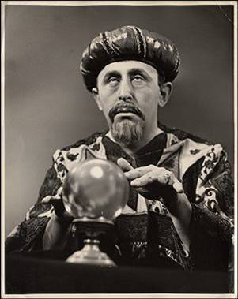

# Previsão de preços de carros usando machine learn.



## As estapas a serem seguidas neste caso de estudo são;

1. Criar um modelo

    - [x] Obter os dados
    Dados obtidos via Microsoft Azure Machine Learn Studio [dados](automobile_price_data_raw_.csv)
    - [x] Preparar os dados
    Aqui realizei a limpeza dos dados excluindo a coluna 'normalized-losses' e todas as linhas com dados faltantes.
    ```python
    # Removendo a coluna normalized-losses
    df = df.drop('normalized-losses', axis=1)
    # Apagando todas as linhas com dados faltantes
    df.dropna(inplace=True)
    ```
    - [x] Definir recursos
    **Definindo os recursos** necessarios para meu caso de estudo as colunas **city-mpg** e **highway-mpg** fazem relação ao consumo de combustivel do veiculo por isso ficarei apenas com umas das colunas. Agora selecionarei apenas algunas colunas para criação do meu modelo.
    ```python
    # Visualizando a cabeça do dataset colunas make,body-style,wheel-base,engine-size,horsepower,peak-rpm,highway-mpg,price
    df[['make','body-style','wheel-base','engine-size','horsepower','peak-rpm','highway-mpg','price']].head()
    ```    
    
2. Treinar o modelo

    - [x] Escolher e aplicar um algoritmo
    Agora com os dados prontos iremos treinar nosso modelo.
    Neste caso de estudo para prever o numero preço/valor do carro utilizarei **regressão linear**, caso fosse a previsão de qual cor de carro seria mais vendida utilizaria classificação.
    
    [giphy.gif]
    
    3. Pontuar e testar o modelo

    - [ ] Prever novos preços de automóveis
